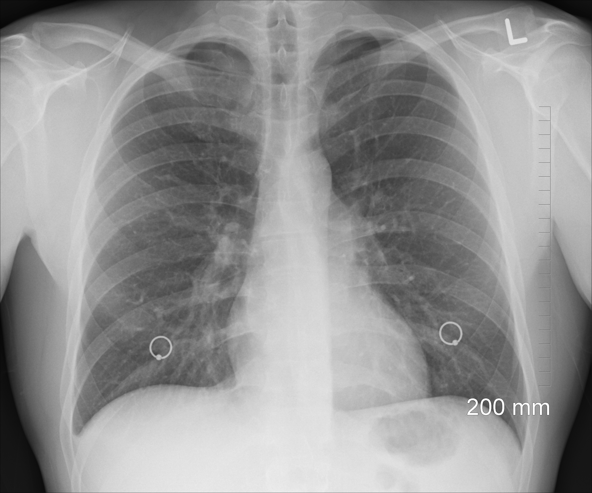

# Oxford : smooth fit to log-odds ratios

## Project summary :

Breslow and Clayton (1993)[1] re-analyse 2 by 2 tables of cases (deaths from childhood cancer)
and controls tabulated against maternal exposure to X-rays, one table for each of 120
combinations of age (0-9) and birth year (1944-1964). The data may be arranged to the following
form [2]

| Strata | Exposure: X-ray / cases | Total cases | age | year - 1954 |
|--------|-------------------------|-------------|-----|-------------|
| 1      | 3/28                    | 0/28        | 9   | -10         |
| ..     | ..                      | ..          | ..  | ..          |
| 120    | 7/32                    | 1/32        | 1   | 10          |

## Sources : 
[1]	N E Breslow and D G Clayton. Approximate inference in generalized linear mixed models. Journal of the American Statistical Association, 88:9–25, 1993.

[2]	OpenBUGS Project Management Group. OpenBUGS Examples Volume I. 2014. version 3.2.3. URL: http://www.openbugs.net/Examples/Volumei.html.

